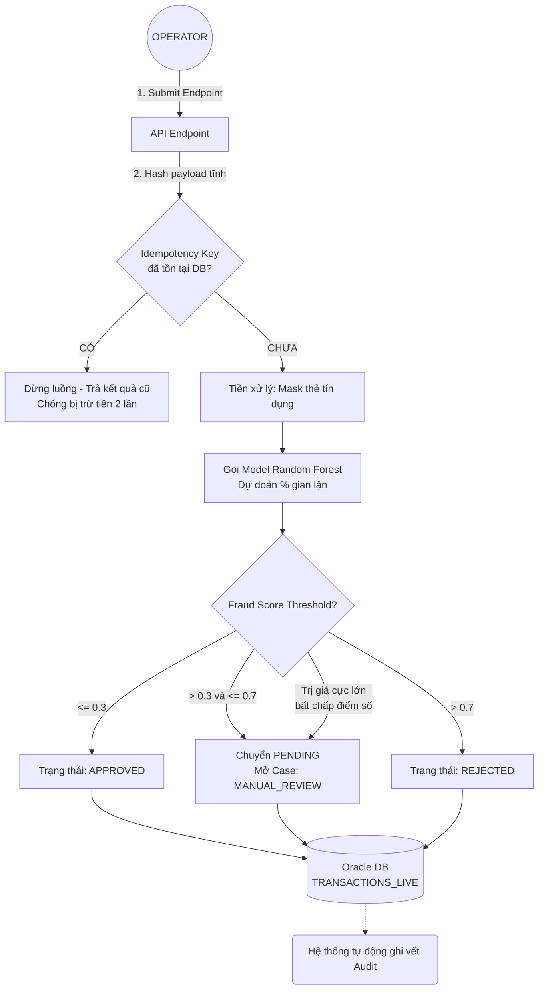
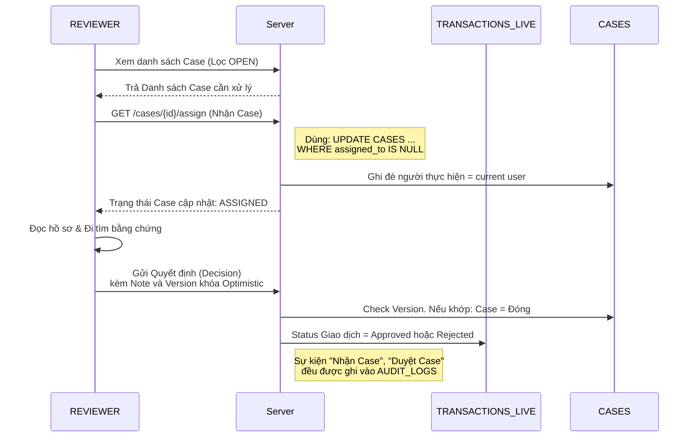
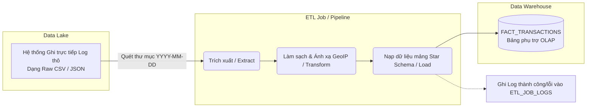
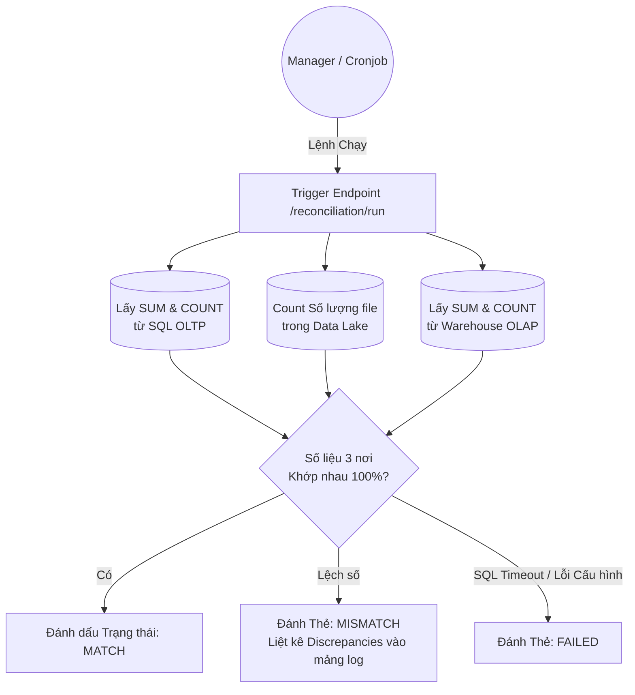
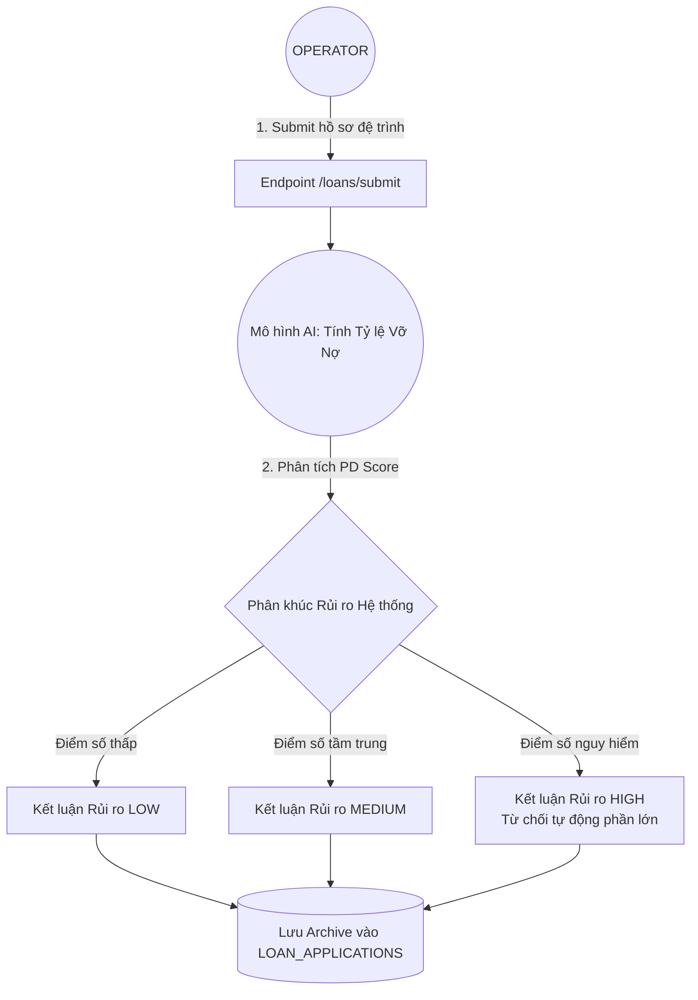

# Luồng Hoạt động Hệ thống (System Workflow)

Tài liệu này mô tả chi tiết các luồng nghiệp vụ cốt lõi bên trong **Transaction Management System (TMS)** được trực quan hóa bằng sơ đồ.

---

## 1. Luồng Nhận & Xử lý Giao dịch (Transaction Processing)

Đây là luồng chính phục vụ với tần suất cao (High Throughput). Trọng tâm là Idempotency để chống lặp và gọi Model AI chấm điểm.

---

## 2. Luồng Xử lý Giao dịch Bị cảnh báo (Manual Case Management)

Dành cho đối tượng `REVIEWER` theo dõi và giải quyết các cảnh báo trung bình. Trọng tâm là dùng Locking để đảm bảo chỉ 1 người được xử lý 1 case.

---

## 3. Luồng Quản trị Dữ liệu (ETL Pipeline)

Tiến trình chạy ngầm làm nhiệm vụ lấy dữ liệu từ các file Log giao dịch thô sang Kho dữ liệu Thống kê phục vụ biểu đồ (Dashboard).

---

## 4. Luồng Đối soát So khớp (Reconciliation)

Chạy lúc chốt phiên ngày, so sánh đối chiếu chéo (3-way match) để xem có sự đứt gãy nào làm thất thoát số liệu hay không.

---

## 5. Luồng Trình giả lập Quyết định Vay vốn (Loan Simulator)

Dành cho module Phân tích Khoản vay với trí tuệ nhân tạo riêng lẻ.

